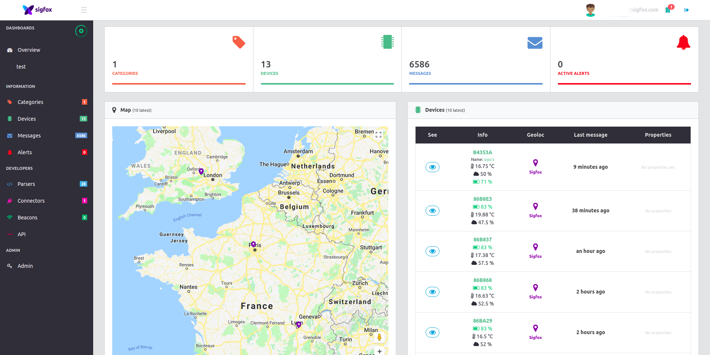
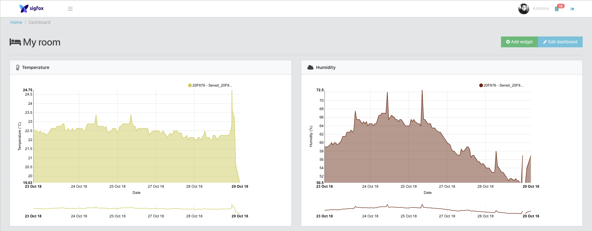
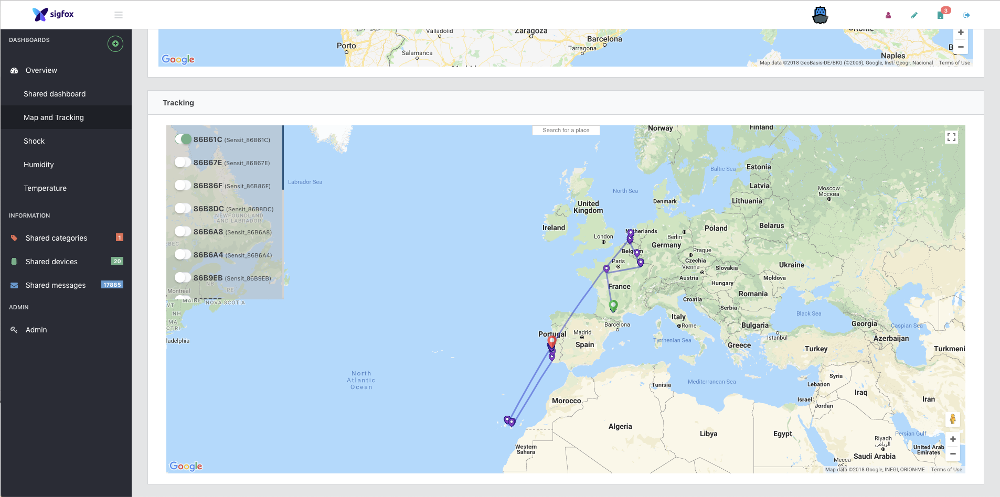
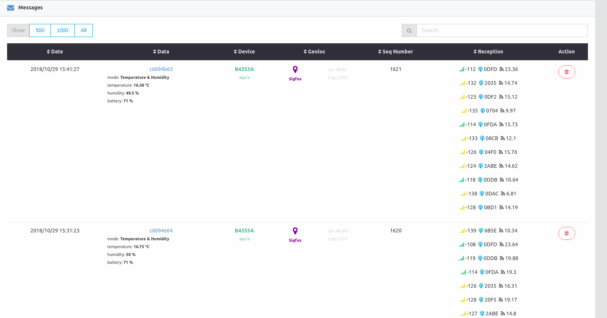
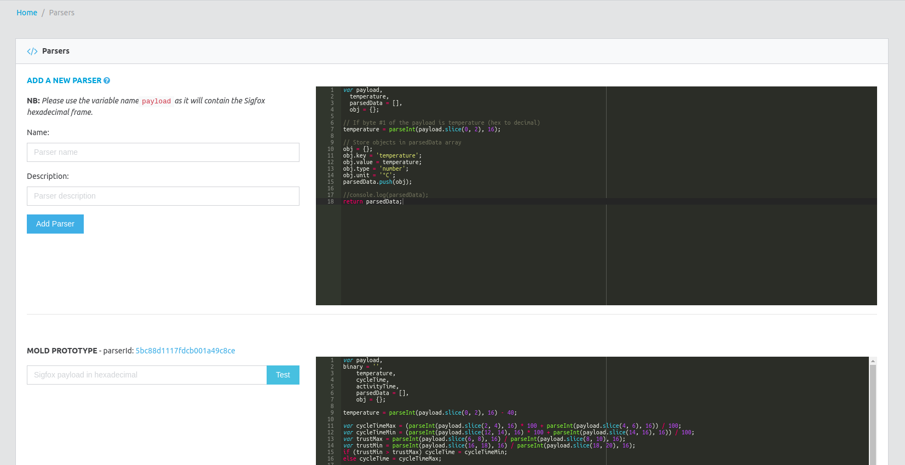
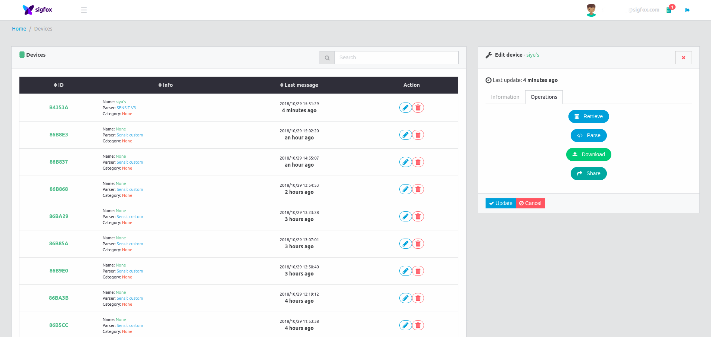

# Sigfox Platform

**Disclaimer: Project under active development, use it at your own risk!**

## About this project
This is a cloud platform to manage Sigfox devices and visualize messages.

## Try it
You can deploy it yourself, but we encourage you to try it out [here](https://try.iotagency.sigfox.com).

## Features  

**Create customizable dashboards**

*charts*

*maps*

**Review raw & decoded data in realtime**

**Create and share parsers**

**Connected to other services with alerts**

**Manage devices, share with others in organization**

## Technologies

### Application

 * **Backend:** [Loopback 3+](https://loopback.io/)
 * **Frontend:** [Angular 6+](https://angular.io/)
 * **Real-time:** [Primus](https://github.com/primus/primus)
 * **Database:** [MongoDB](https://www.mongodb.com/en)
 * **Pub-sub:** [Redis](https://redis.io/)
 
 ### Deployment
 
 * **Reverse proxy:** [Traefik](https://traefik.io/)
 * **Containerization:** [Docker](https://www.docker.com/)
 * **Orchestrator:** [Docker Swarm](https://docs.docker.com/engine/swarm/)
 * **Management UI:** [Portainer](https://portainer.io/)
 * **Supervision:** [Prometheus](https://prometheus.io/)

## Development

### Requirements

### API (To Be Updated, below is an old version)

Below is the functional/sequential diagram representing the message journey.

### Frontend

#### Color code

| GPS | Sigfox | WiFi | BLE |
| :-------: | :-------: | :-------:	| :-------: |
|  `#9B7A48` |  `#792FAA` |  `#2F2A30` |  `#3C58CE` |

#### Developers

##### Linking a Sigfox device to the platform

Once the application is deployed, head over to the 'connectors'. You will need to create a developer access token in order to secure the API calls. You can then copy & paste the callback information you need in the device type new callback onto the [Sigfox Backend](https://backend.sigfox.com/).

##### Adding a custom parser

A short wiki can be found [here](https://github.com/IoT-Makers/sigfox-platform/wiki/Adding-a-custom-parser).

## Roadmap

## Authors

* [Antoine de Chassey](https://github.com/AntoinedeChassey)
* [Louis Moreau](https://github.com/luisomoreau)

## Contributors

Feel free to submit a Pull Request and don't forget to add you name and your useful links ;)

> Made with &nbsp;:heart:&nbsp; by Antoine de Chassey & Louis Moreau
